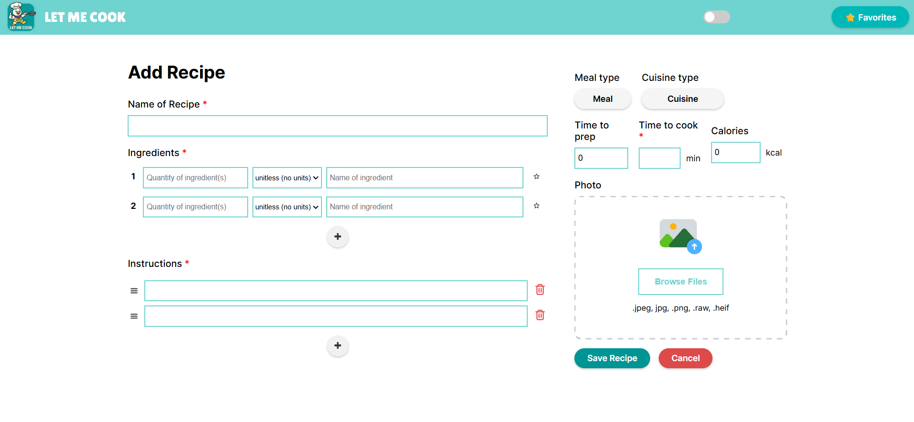
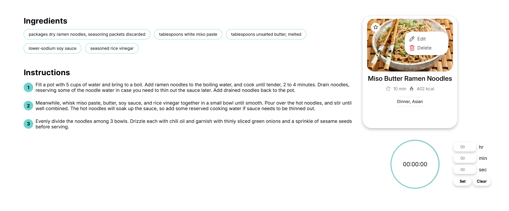
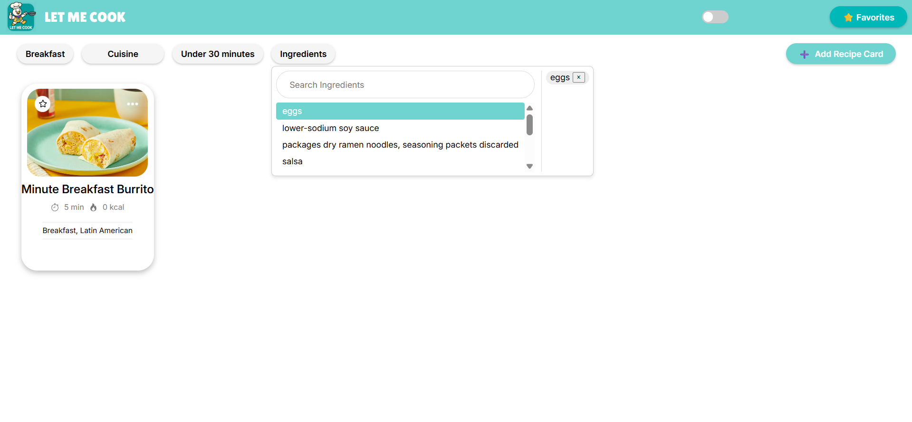
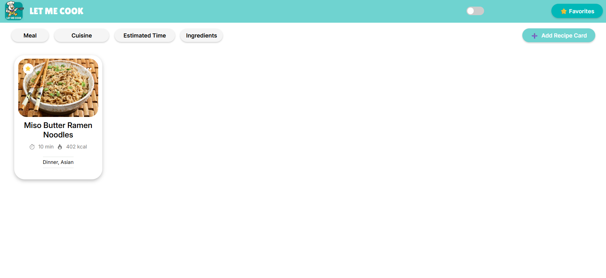
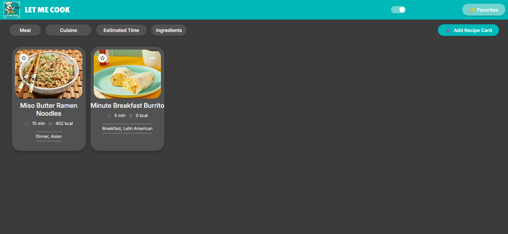
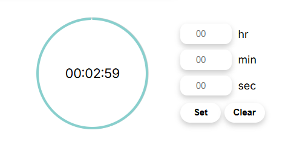

<!-- PROJECT LOGO -->
<div align="center">
  <a href="https://github.com/cse110-sp25-group8/final-project">
    
  </a>
  <h3 align="center">Let Me Cook</h3>
</div>

# Welcome to Let Me Cook 👋
Let Me Cook helps users save their favorite recipes by storing them digitally and locally on the website.

**Deployment**: [Link to live project](https://cse110-sp25-group8.github.io/final-project/).

## Table of Contents
| Contents |
| ---- |
| [Features](#features) | 
| [Setup](#setup) |
| [Documentation](#documentation) |
| [Authors](#authors) |
| [Videos](#videos) |

## Features
### Creating Recipe
Allows user to input their own recipe card.


### Editing/Deleting Recipe
Allows user to edit/delete recipe.


### Filtering
the user can filter by meal type, cuisine, estimated time, or by ingredients found in the recipes.


### Favoriting
The user can favorite recipes and then filter for favorites.


### Dark Mode
The user can switch from light and dark mode.


### Timer
The user can set a timer within viewing the recipe that has a voice telling you when the time is up.



## Getting Started
### Setup
Clone the repository to your local machine
```sh
git clone https://github.com/cse110-sp25-group8/final-project.git
```

Change into the project directory
```sh
cd final-project
```

Install Dependencies (ESLint)
```sh
npm install
```

Run the application
```sh
npm start
```

### Documentation
- Documentation: [JSDocs](https://cse110-sp25-group8.github.io/final-project/docs/index.html)
- Designs: [Figma](https://www.figma.com/design/irNLLpXTwAfdSlNrlvWBAJ/LET-ME-COOK)

#### Logistical Documentation
- Project Planning: [Miro Board](https://miro.com/app/board/uXjVI-wtmtQ=/?share_link_id=525428474061)
- Decisions: [Archiectural Decision Records](https://github.com/cse110-sp25-group8/cse110-sp25-group8/tree/main/specs/adrs)
- Demos: [Videos](https://github.com/cse110-sp25-group8/cse110-sp25-group8/tree/main/admin/videos)
- Style Guide: [Doc](https://github.com/cse110-sp25-group8/cse110-sp25-group8/blob/main/specs/adrs/1.4.1_style-guide.md)
 
## Authors
Let Me Cook was made with ❤️ by Team Ate.

👤 **Ashley Vo (TEAM LEAD)** - Github: [@avo-ucsd](https://github.com/avo-ucsd)

👤 **Chanbin Na (TEAM LEAD)** - Github: [@chanbinna](https://github.com/chanbinna)

👤 **Dorjé Pradhan** - Github: [@doorjay](https://github.com/doorjay)

👤 **Vy Kiet Dang** - Github: [@kdang002](https://github.com/kdang002)

👤 **Phyo Thant aka Patrick** - Github: [@PhyoTh](https://github.com/PhyoTh)

👤 **Kiara Singh** - Github: [@Kiarasinghh](https://github.com/Kiarasinghh)
  
👤 **Arlene Garcia** - Github: [@arlenecse](https://github.com/arlenecse)

👤 **Ryan Awal** - Github: [@ryanawal12](https://github.com/ryanawal12)

👤 **Minahil Yasar** - Github: [@minahilyasar](https://github.com/minahilyasar)

👤 **Samson Gebrekidan** - Github: [@Samat4E](https://github.com/Samat4E)

👤 **Shashwat Dudeja** - Github: [@shash31](https://github.com/shash31)

## Videos
- [Here is a link to our **public demo** and retrospective video for this project](https://youtu.be/E_IANp1SsKU).
- [Here is a link to our **private retrospective** of this project and quarter](https://www.youtube.com/watch?v=-jX6OiMZvoQ).
