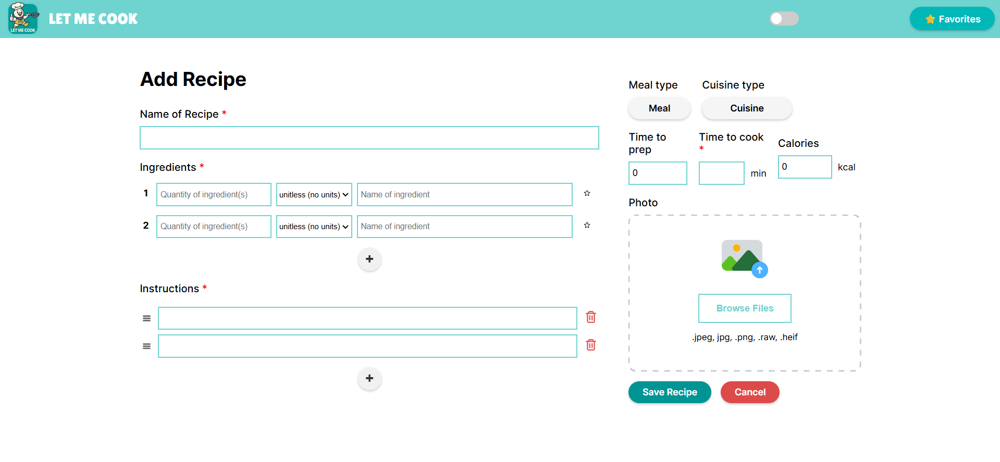
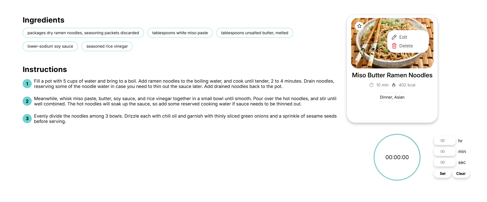
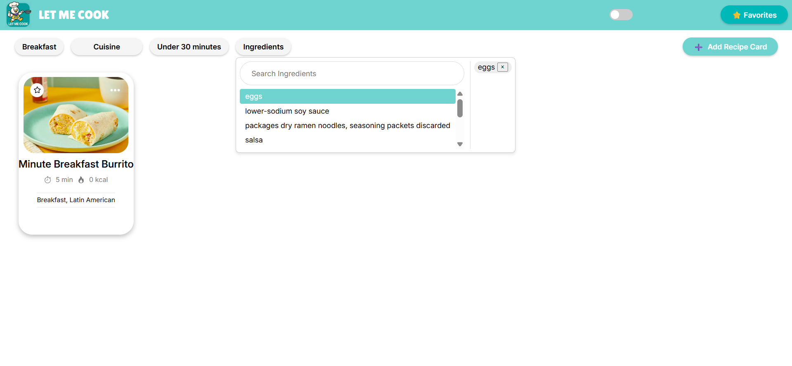
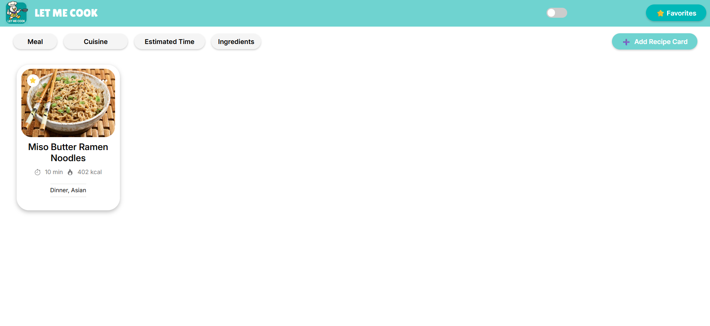
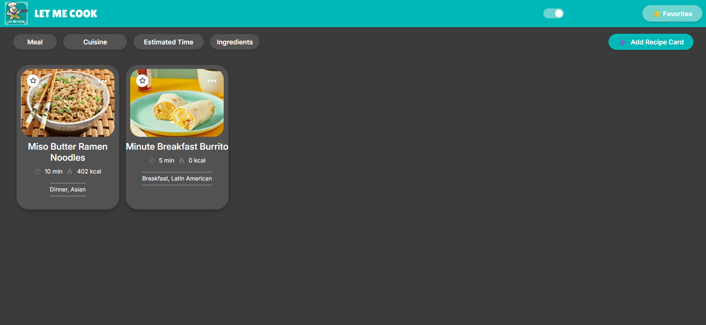
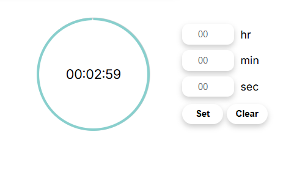

# Welcome to Let Me Cook 👋
> The purpose of Let Me Cook is to help users save their favorite recipes by storing them digitally on the website. Our intended audience is college students.

Deployment: [Link to Github Page](https://cse110-sp25-group8.github.io/final-project/)

## Features
### Creating Recipe
Allows user to input their own recipe card.


### Editing/Deleting Recipe
Allows user to edit/delete recipe.


### Filtering
Can filter by meal type, cuisine, estimated time, or by ingredients found in the recipes.


### Favoriting
Can favorite recipes and then filter for favorites.


### Dark Mode
Can switch from light and dark mode.


### Timer
Can set a timer within viewing the recipe that has a voice telling you when the time is up.


## Setup
Clone the repository to your local machine
```sh
git clone https://github.com/cse110-sp25-group8/final-project.git
```

Change into the project directory
```sh
cd final-project
```

Install Dependencies (ESLint)
```sh
npm install
```

Run the application
```sh
npm start
```

## Documentation
Planning: [Miro Board](https://miro.com/app/board/uXjVI-wtmtQ=/?share_link_id=525428474061)

Decisions: [ADRs](https://github.com/cse110-sp25-group8/cse110-sp25-group8/tree/main/specs/adrs)

Demos: [Videos](https://github.com/cse110-sp25-group8/cse110-sp25-group8/tree/main/admin/videos)


## Authors

👤 **Ashley Vo (TEAM LEAD)**

* Github: [@avo-ucsd](https://github.com/avo-ucsd)
  
👤 **Chanbin Na (TEAM LEAD)**

* Github: [@chanbinna](https://github.com/chanbinna)

👤 **Dorjé Pradhan**

* Github: [@doorjay](https://github.com/doorjay)

👤 **Vy Kiet Dang**

* Github: [@kdang002](https://github.com/kdang002)

👤 **Phyo Thant aka Patrick**

* Github: [@PhyoTh](https://github.com/PhyoTh)

👤 **Kiara Singh**

* Github: [@Kiarasinghh](https://github.com/Kiarasinghh)
  
👤 **Arlene Garcia**

* Github: [@arlenecse](https://github.com/arlenecse)

👤 **Ryan Awal**

* Github: [@ryanawal12](https://github.com/ryanawal12)

👤 **Minahil Yasar**

* Github: [@minahilyasar](https://github.com/minahilyasar)

👤 **Samson Gebrekidan**

* Github: [@Samat4E](https://github.com/Samat4E)

👤 **Shashwat Dudeja**

* Github: [@shash31](https://github.com/shash31)